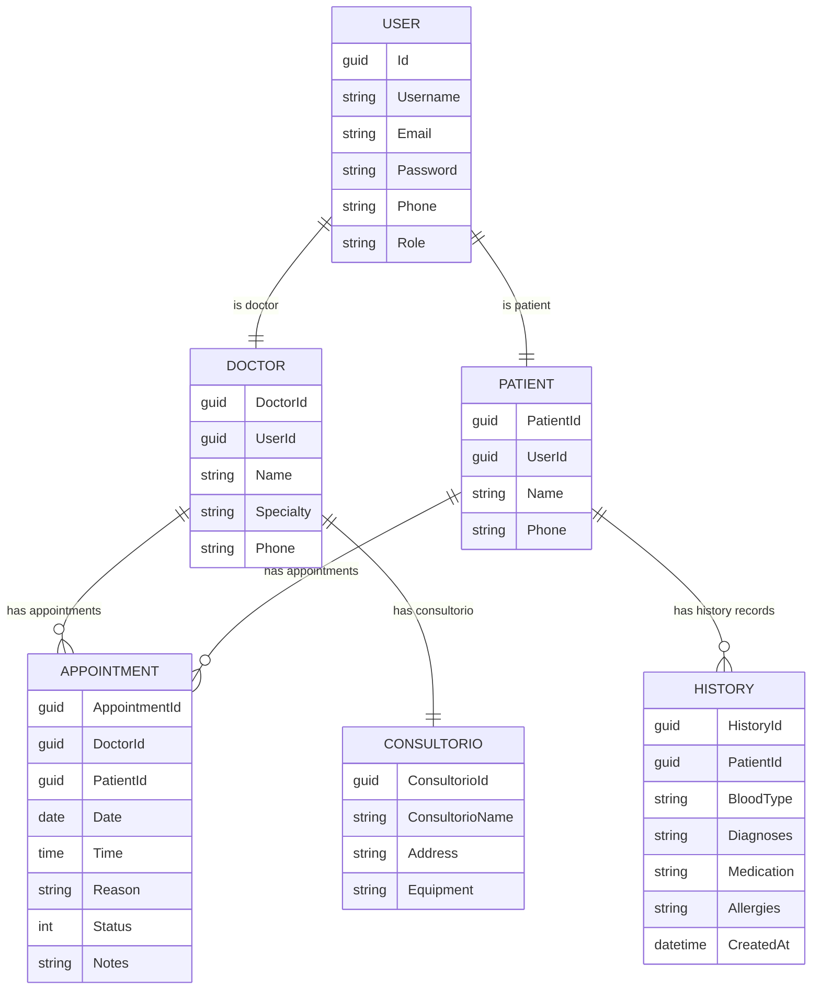

# TEC WEB PROYECTO 
#  SaludTotal – Sistema de Turnos Médicos 

**SaludTotal** es una API RESTful desarrollada con **ASP.NET Core 9**. Su propósito es gestionar doctores, pacientes, citas médicas, historial clínico y consultorios dentro de un sistema clínico moderno.

El objetivo es centralizar la programación de turnos y la información médica, eliminando la gestión manual y los errores frecuentes, ofreciendo una solución **segura, escalable y mantenible**.

---

##  1. Arquitectura del Proyecto

El sistema sigue una **Arquitectura por Capas (Layered Architecture)** para separar responsabilidades y mejorar la mantenibilidad.

###  Capas del Proyecto

| Carpeta        | Responsabilidad                                                |
|----------------|----------------------------------------------------------------|
| **Controller** | Maneja las peticiones HTTP (GET, POST, PUT, DELETE).           |
| **Services**   | Contiene la lógica de negocio y validaciones.                  |
| **Repositories** | Se encarga del acceso a datos usando Entity Framework Core.   |
| **Models**     | Define las entidades del dominio (User, Doctor, Appointment).  |
| **Data**       | Contiene el `AppDbContext` y configuración de la BD.           |
| **DTOs**       | Modelos para transferencia de datos entre capa y capa.         |

---

##  2. Funcionalidades del Sistema

###  Gestión de Autenticación (Auth)

- Registro de usuarios  
- Inicio de sesión con JWT  
- Refresh Token  
- Logout  
- Roles: `Admin` y `User`

###  Doctores

- Registrar doctor (**Admin**)  
- Editar doctor  
- Listar doctores  
- Consultar por ID  
- Eliminar doctor  
- Relación 1:1 con `User`

###  Pacientes (Patient)

- Información básica del paciente  
- Relación 1:1 con `User`  
- Relación con citas médicas e historial

###  Citas Médicas (Appointments)

- Crear cita (**Admin**)  
- Asignar doctor y paciente  
- Cambiar estado (Pendiente, Confirmada, Cancelada)  
- Actualizar fecha, hora o notas  
- Buscar citas por doctor  
- Buscar citas por paciente  

>  **Nota importante de modelo:**  
> `Appointment` actúa como una **tabla intermedia con atributos**.  
> A nivel de base de datos se modela como:
>
> - Doctor **1:N** Appointment  
> - Patient **1:N** Appointment  
>
> Pero conceptualmente define una relación **N:M entre Doctor y Patient**:
> un doctor puede atender a muchos pacientes y un paciente puede ser atendido por muchos doctores, y cada encuentro se representa con una cita.

###  Historial (History) 

- **Diagnósticos:** Registro de condiciones detectadas.
- **Medicación:** Registro de medicamentos recetados.
- **Alergias:** Información crítica del paciente.
- **Tipo de Sangre:** Dato inmutable del paciente.
- Relación 1:1 con `Patient`. 

###  Consultorio

- Dirección  
- Equipamiento  
- Relación 1:1 con `Doctor`  

---

##  3. Diagrama ER

Basado en el modelo diseñado para **Salud Total**:

### Entidades y Atributos

| Entidad         | Atributos Principales                                                       | Descripción                                  |
|-----------------|-----------------------------------------------------------------------------|----------------------------------------------|
| **User**        | Id, Username, Password, Email, Phone, Role                                  | Credenciales del sistema                     |
| **Doctor**      | DoctorId, UserId, Name, Specialty, Phone                                    | Información del médico                       |
| **Patient**     | PatientId, UserId, Name, Phone                                              | Datos del paciente                           |
| **Appointment** | AppointmentId, DoctorId, PatientId, Date, Time, Reason, Status, Notes       | Cita médica (turno)                          |
| **History**     | HistoryId, PatientId, BloodType, Diagnoses, Medication, Allergies           | Historial del paciente                       |
| **Consultorio** | ConsultorioId, ConsultorioName, Address, Equipment                          | Consultorio asignado a un doctor             |




### Relaciones

- **User – Doctor:** 1:1  
- **User – Patient:** 1:1  
- **Doctor – Appointment:** 1:N  
- **Patient – Appointment:** 1:N  
- **Doctor – Patient:** N:M **a través de Appointment**  
- **Patient – History:** 1:1  
- **Doctor – Consultorio:** 1:1  

---

##  4. Autenticación y Autorización (JWT)

El sistema implementa autenticación mediante **JSON Web Tokens**:

### Flujo:

1. El usuario envía email + contraseña  
2. La API valida credenciales  
3. Devuelve **AccessToken** y **RefreshToken**  
4. El token se envía en cada request protegida:

```http
Authorization: Bearer <token>
```
Roles disponibles

Admin → Acceso total (CRUD y administración general)

User → Lectura y operaciones básicas permitidas

---

##  5. EndPoints

### Auth (Autenticación y Autorización)

| Método | Endpoint                     | Auth / Rol     | Descripción                                      |
|--------|------------------------------|----------------|--------------------------------------------------|
| POST   | `/api/v1/Auth/register`      | Público        | Registra un nuevo usuario (Admin o User).        |
| POST   | `/api/v1/Auth/login`         | Público        | Inicia sesión y devuelve AccessToken + Refresh.  |
| POST   | `/api/v1/Auth/refresh`       | Público        | Renueva el AccessToken usando el RefreshToken.   |
| POST   | `/api/v1/Auth/logout`        | Autenticado    | Cierra sesión y revoca el refresh token activo.  |

---

###  Doctor

| Método | Endpoint                     | Auth / Rol      | Descripción                                      |
|--------|------------------------------|-----------------|--------------------------------------------------|
| GET    | `/api/v1/Doctor`             | Autenticado     | Lista todos los doctores.                        |
| GET    | `/api/v1/Doctor/{id}`        | Autenticado     | Obtiene el detalle de un doctor por su Id.       |
| POST   | `/api/v1/Doctor`             | Admin           | Crea un nuevo doctor asociado a un User.         |
| PUT    | `/api/v1/Doctor/{id}`        | Admin           | Actualiza los datos de un doctor existente.      |
| DELETE | `/api/v1/Doctor/{id}`        | Admin           | Elimina un doctor por su Id.                     |

---

###  Consultorio

| Método | Endpoint                          | Auth / Rol      | Descripción                                        |
|--------|-----------------------------------|-----------------|----------------------------------------------------|
| GET    | `/api/v1/Consultorio`            | Autenticado     | Lista todos los consultorios.                      |
| GET    | `/api/v1/Consultorio/{id}`       | Autenticado     | Obtiene el detalle de un consultorio por Id.       |
| POST   | `/api/v1/Consultorio`            | Admin           | Crea un nuevo consultorio.                         |
| PUT    | `/api/v1/Consultorio/{id}`       | Admin           | Actualiza la información de un consultorio.        |
| DELETE | `/api/v1/Consultorio/{id}`       | Admin           | Elimina un consultorio por Id.                     |

---

###  History (Historial)

| Método | Endpoint                          | Auth / Rol      | Descripción                                        |
|--------|-----------------------------------|-----------------|----------------------------------------------------|
| GET    | `/api/v1/History`                 | Autenticado     | Lista los historiales médicos.                      |
| GET    | `/api/v1/History/{id}`            | Autenticado     | Obtiene un historial específico.                   |
| POST   | `/api/v1/History`                 | Autebticado     | Crea un registro. Req: PatientId, BloodType (4-5 chars).|
| PUT    | `/api/v1/History/{id}`            | Autenticado     | Actualiza Diagnóstico, Medicación o Alergias. Nota: No permite cambiar Paciente ni Tipo de Sangre.|

---

###  Appointment (Citas médicas)

| Método | Endpoint                               | Auth / Rol      | Descripción                                                |
|--------|----------------------------------------|-----------------|------------------------------------------------------------|
| GET    | `/api/v1/Appointment`                  | Autenticado     | Lista todas las citas médicas.                             |
| GET    | `/api/v1/Appointment/{id}`             | Autenticado     | Obtiene el detalle de una cita por Id.                     |
| POST   | `/api/v1/Appointment`                  | Autenticado     | Crea una nueva cita (requiere `DoctorId` y `PatientId`).   |
| PUT    | `/api/v1/Appointment/{id}`             | Autenticado     | Actualiza los datos de una cita existente.                 |
| DELETE | `/api/v1/Appointment/{id}`             | Admin           | Elimina una cita por Id.                                   |

---

##  6. Swagger Documentation

El proyecto incluye documentación interactiva con Swagger.

 URL por defecto:
```
http://localhost:5020/swagger
```

Desde ahí se pueden:

- Probar endpoints

- Ver modelos y respuestas

- Autorizar con JWT (botón Authorize)

---

##  7. Instalación y Configuración
Requisitos

- .NET 9 SDK

- PostgreSQL (o Docker)

- Postman (recomendado para pruebas)

**1. Clonar repositorio**
```
git clone https://github.com/RashLop/ProyectoTecWeb.git

cd ProyectoTecWeb
```
**2. Configurar archivo .env**

Ejemplo:
```
DATABASE_HOST=localhost
POSTGRES_DB=Hospitaldb
POSTGRES_USER=Hospitaluser
POSTGRES_PASSWORD=supersecret
POSTGRES_PORT=5432

JWT_KEY=ClaveSuperSECRETA
JWT_ISSUER=MiApi
JWT_AUDIENCE=MiCliente
JWT_EXPIRES=60
JWT_REFRESH=14
```
**3. Levantar PostgreSQL con Docker**
```
docker run --name hospitaldb -e POSTGRES_DB=Hospitaldb -e POSTGRES_USER=Hospitaluser -e POSTGRES_PASSWORD=supersecret -p 5432:5432 -d postgres:16
```
**4. Ejecutar la API**
```
dotnet run
```
La API estará disponible en:
```
http://localhost:5020
```

---

##  8. Datos de Prueba (Demo)

| Email           | Password   | Rol  |
|-----------------|-----------|-------|
| admin@gmail.com | P@ssw0rd  | Admin |
| user@gmail.com  | User1234  | User  |

---

##  9. Pruebas en Postman

### 9.1 Importar colección de Postman

En el repositorio se incluye una colección de Postman para probar la API de **Salud Total**:

 **Archivo:**  
````
docs/postman/SaludTotal.postman_collection.json
````

Esta colección contiene carpetas para:

- **Auth** (Register, Login, Refresh, Logout)
- **Doctor**
- **Consultorio**
- **Appointment**
- **Patient**
- **History**

y usa **Collection Variables** (no necesitas crear Environment).

#### Pasos para usarla

1. Abrir **Postman**
2. Clic en **Import**
3. Seleccionar el archivo:

   ```text
   docs/postman/SaludTotal.postman_collection.json
Verás una colección llamada: Salud Total – API

Opcionalmente, puedes revisar/editar las variables de la colección en:

Clic en la colección → pestaña Variables

### 9.2 Variables principales usadas

| Variable        | Descripción                                   | Valor por defecto               |
|-----------------|-----------------------------------------------|---------------------------------|
| **baseUrl**     | URL base de la API                            | `http://localhost:5020`         |
| **token**       | Access Token (JWT)                            | *(se completa al hacer login)*  |
| **refreshToken**| Refresh Token                                 | *(se completa al hacer login)*  |
| **adminUserId** | Id del usuario administrador                  | *(se completa al hacer login)*  |
| **doctorId**    | Id del doctor creado                          | *(se completa al crear doctor)* |
| **appointmentId** | Id de la cita creada                        | *(se completa al crear cita)*   |
| **historyId** | Id del historial médico creado                  | *(se completa al crear consultorio)* |
| **patientId**   | Id del paciente creado                        | *(se completa al crear patient)* |

---

### 9.3  Flujo recomendado de pruebas

#### **1) Auth → Register (Administrador)**  
- **Request:** `Auth / 01. Register Admin`  
- **Endpoint:** `POST {{baseUrl}}/api/v1/Auth/register`

Se registra un usuario con rol **Admin** (solo la primera vez).

---

#### **2) Auth → Login**
- **Request:** `Auth / 02. Login Admin`  
- **Endpoint:** `POST {{baseUrl}}/api/v1/Auth/login`

Si el login es correcto, la colección guarda automáticamente:

- `token`
- `refreshToken`
- `adminUserId`

---

#### **3) Uso de Bearer Token**

La colección ya está configurada para enviar:
````
Authorization: Bearer {{token}}
````

Por lo tanto, **no necesitas configurar nada manualmente** después de iniciar sesión.

---

### 9.4  Pruebas de entidades principales

---

##  Doctor

### **Crear Doctor**
- **Request:** `Doctor / 01. Create Doctor (1:1 con User)`
- **Endpoint:** `POST {{baseUrl}}/api/v1/Doctor`

Usa:

- `userId = {{adminUserId}}`

Al crear el doctor, la colección guarda:

- `doctorId`

### **Listar Doctores**
- **Request:** `Doctor / 02. Get All Doctors`
- **Endpoint:** `GET {{baseUrl}}/api/v1/Doctor`

---

##  Consultorio

### **Crear Consultorio**
- **Request:** `Consultorio / 01. Create Consultorio`
- **Endpoint:** `POST {{baseUrl}}/api/v1/Consultorio`

Campos:

- `consultorioName`
- `address`
- `equipment`

Se guarda automáticamente:

- `consultorioId`

### **Listar Consultorios**
- **Request:** `Consultorio / 02. Get All Consultorios`
- **Endpoint:** `GET {{baseUrl}}/api/v1/Consultorio`

---

##  Appointment (Citas médicas)

La entidad Appointment representa la relación **N:M entre Doctor y Patient**.

### **Crear Cita**
- **Request:** `Appointment / 01. Create Appointment`
- **Endpoint:** `POST {{baseUrl}}/api/v1/Appointment`

Requiere:

- `doctorId`
- `patientId`
- `date`
- `time`
- `reason`

Se guarda automáticamente:

- `appointmentId`

### **Listar todas las citas**
- **Request:** `Appointment / 02. Get All Appointments`
- **Endpoint:** `GET {{baseUrl}}/api/v1/Appointment`

### (Opcional) Filtros
- **Por Doctor:** `GET /api/v1/Appointment/doctor/{doctorId}`
- **Por Paciente:** `GET /api/v1/Appointment/patient/{patientId}`

---

### 9.5 Validación de resultados

#### **Códigos HTTP esperados**

| Operación                    | Status esperado |
|------------------------------|-----------------|
| Register Admin               | `201 Created`   |
| Login Admin                  | `200 OK`        |
| Crear Doctor                 | `201 Created`   |
| Listar Doctores              | `200 OK`        |
| Crear Consultorio            | `201 Created`   |
| Listar Consultorios          | `200 OK`        |
| Crear Cita                   | `201 Created`   |
| Listar Citas                 | `200 OK`        |

---

###  Relaciones validadas en Postman

- El doctor creado aparece correctamente en la lista.
- El consultorio se registra y aparece en las consultas.
- Las citas muestran correctamente:
  - `doctorId`
  - `patientId`
- Las relaciones lógicas se cumplen:

#### **Doctor**
- puede tener muchas citas (1:N)

#### **Patient**
- puede tener muchas citas (1:N)

#### **Doctor ↔ Patient**
- relación **N:M**, representada por la tabla **Appointment**

---

## 10. TimeGate (Rate Limiting)

El proyecto **Salud Total** implementa un sistema de **Rate Limiting** usando el middleware de `AspNetCore.RateLimiting`.  
Este mecanismo protege la API de abuso, evitando que un mismo cliente envíe demasiadas solicitudes en muy poco tiempo.

En `Program.cs` se configura un limitador de ventana fija llamado **"fixed"**.

### Configuración efectiva
Esta API implementa una política de límite de tasa para prevenir abusos y garantizar la estabilidad del servicio.

| Parámetro | Valor | Descripción |
| :--- | :--- | :--- |
| **Policy Name** | `"fixed"` | Nombre identificador del limitador registrado en el sistema. |
| **Tipo** | Fixed Window | Algoritmo de ventana fija. Cuenta las solicitudes en un bloque de tiempo estático. |
| **Ventana de tiempo** | 10 segundos | El contador de solicitudes se reinicia cada 10 segundos. |
| **Solicitudes permitidas** | 5 | Se permiten máximo 5 solicitudes directas por ventana de tiempo. |
| **Cola (QueueLimit)** | 2 | Si se supera el límite, hasta 2 solicitudes adicionales pueden quedar en espera. |
| **Orden de cola** | `OldestFirst` | Las solicitudes que llevan más tiempo en la cola se procesan primero. |
| **Respuesta al exceder** | `HTTP 429` | Si se llenan el límite y la cola, la API retorna el estado *Too Many Requests*. |

### Comportamiento cuando se excede el límite
Si un cliente envía más de 5 solicitudes (y se llenan las 2 de cola) dentro de los mismos 10 segundos, la API responde:

````
HTTP 429 Too Many Requests
````
Esto indica que el cliente debe esperar a que termine la ventana de 10 segundos antes de seguir haciendo peticiones.

---

## 11. Conclusión Final

**Salud Total** se consolida como una API moderna, segura y diseñada profesionalmente. Gracias a su **Arquitectura por Capas**, logramos una clara separación de responsabilidades (Controladores, Servicios, Repositorios, DTOs), lo que garantiza un código limpio, fácil de mantener y preparado para escalar.

Puntos clave del desarrollo:

- **Modelado de Datos Robusto:** Refleja fielmente el funcionamiento real de un entorno clínico, integrando entidades complejas (Doctores, Pacientes, Citas, Historial médico, Consultorio) mediante relaciones relacionales eficientes (1:1, 1:N, N:M).
- **Seguridad Integral:** La implementación de autenticación vía **JWT** y la autorización basada en Roles aseguran que cada recurso sea accedido únicamente por usuarios permitidos.
- **Protección Avanzada:** La inclusión de **Rate Limiting** blinda la API contra saturación o abusos, mejorando la disponibilidad del servicio.
- **Despliegue y Pruebas:** Con el uso de **Docker**, variables de entorno y colecciones de **Postman**, aseguramos un ciclo de desarrollo y despliegue consistente y repetible.
 

